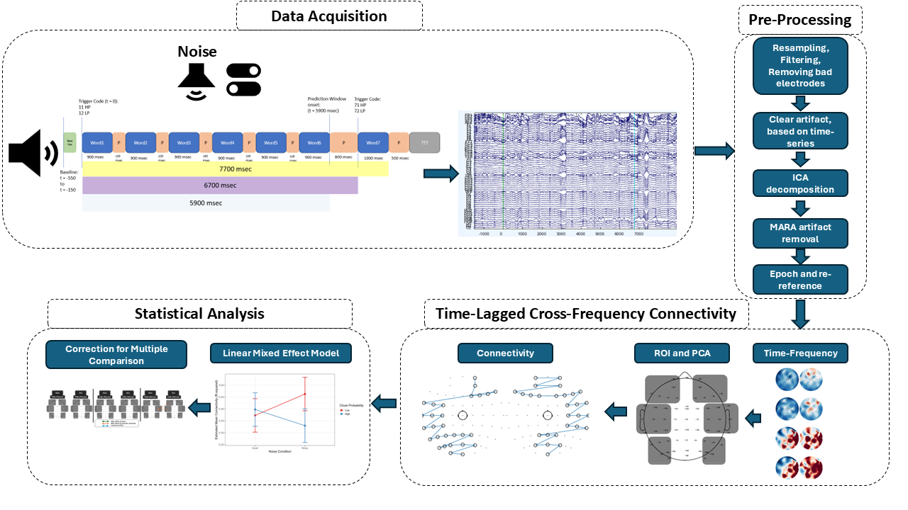

# EEG Preprocessing and Cross-Frequency MDPC Analysis Pipeline

This project provides the complete analysis pipeline for an investigation into the neural mechanisms of speech-in-noise comprehension. The central challenge the brain faces is balancing the suppression of auditory distractions with the use of semantic context to predict upcoming words.

This is accomplished through the coordination of multiple neural oscillations:
* **Alpha (~9–12 Hz):** Linked to inhibiting irrelevant noise and gating information flow.
* **Theta (~4–8 Hz):** Implicated in lexical retrieval and processing the speech signal itself.
* **Beta (~13–30 Hz):** Associated with maintaining information and propagating top-down predictions.

This codebase implements a novel ** Cross-Frequency Time-Lagged Multidimensional Connectivity** analysis to investigate how these distinct frequency bands interact across brain networks. The goal is to map the dynamic, time-lagged flow of information as the brain adapts to sentences with varying levels of predictability in both quiet and noisy environments.

---

## Workflow Overview

The analysis pipeline proceeds in three distinct stages, moving from raw data to final statistical results. Each stage is handled by a different language and must be run in the specified order.



---

## Project Structure

* [`scripts/`](./scripts/) - _Contains all analysis code, organized by language._
    * [`matlab/`](./scripts/matlab/)
        * [`0_Information_Extraction.m`](./scripts/matlab/0_Information_Extraction.m)
        * [`1_Cleaning_Pipeline.m`](./scripts/matlab/1_Cleaning_Pipeline.m)
    * [`python/`](./scripts/python/)
        * [`2_run_extraction.py`](./scripts/python/2_run_extraction.py) - _Main script for MDPC analysis._
        * [`config.py`](./scripts/python/config.py)
        * [`connectivity.py`](./scripts/python/connectivity.py)
    * [`R/`](./scripts/R/)
        * [`3_run_analysis.R`](./scripts/R/3_run_analysis.R) - _Main script for statistical analysis._
        * [`functions.R`](./scripts/R/functions.R)

* [`results/`](./results/) - _Default location for all generated CSV files and plots._
* [`README.md`](./README.md) - _Project overview and instructions._
* [`.gitignore`](./.gitignore) - _Specifies files and folders for Git to ignore._

---

## Setup and Installation

### 1. MATLAB
* **MathWorks MATLAB**
* **EEGLAB Toolbox**: Ensure EEGLAB is installed and added to your MATLAB path. This pipeline relies on EEGLAB functions for preprocessing.

### 2. Python
It is recommended to use a virtual environment.

```bash
# Create and activate a virtual environment
python -m venv venv
source venv/bin/activate  # On Windows use `venv\Scripts\activate`

# Install required packages
pip install numpy pandas mne scikit-learn tqdm scipy
